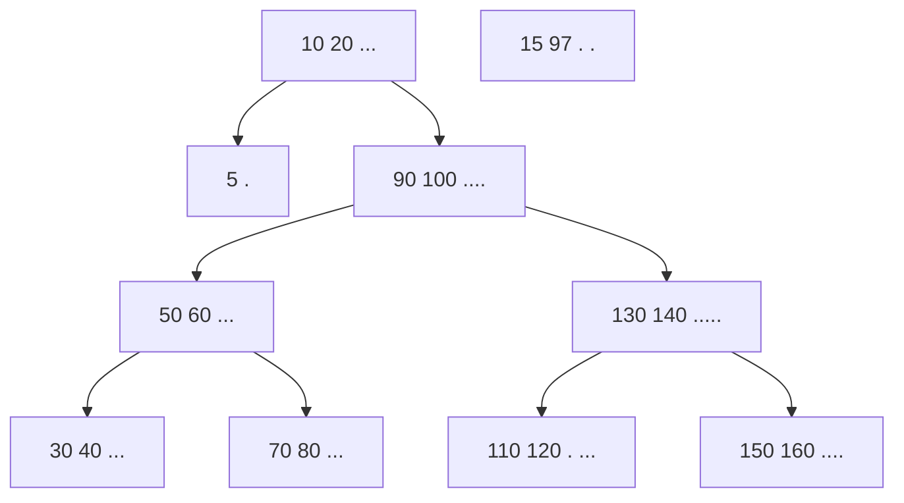
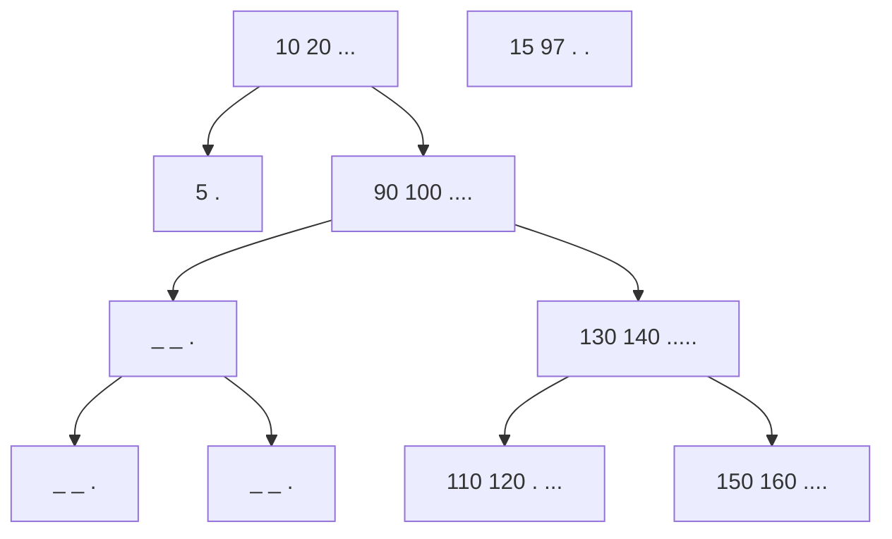
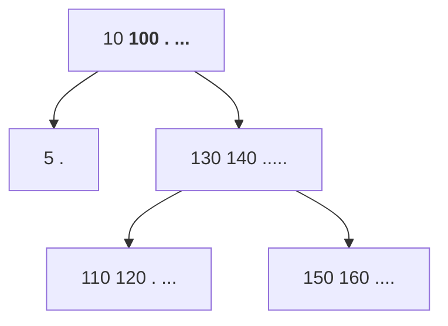

# Intérprete para operar con conjuntos numéricos
 Por **Leonid ChancC**
 
El programa comprende de un intérprete, el cual soporta las operaciones de `UNION` `INTERSECCION` `RESTA`  y`COMPLEMENTO`. Además de poder definir conjuntos de enteros ya sea por `extención` o `comprensión`

Tabla de contenidos:
-   [**Intérprete para operar con conjuntos numéricos**](#int%C3%A9rprete-para-operar-con-conjuntos-num%C3%A9ricos)
    -   [**Inicio rápido**](#inicio-r%C3%A1pido)
    -   [**Fundamentos**](#fundamentos)
        -   [Compilación](#compilaci%C3%B3n)
        -   [Conceptos del intérprete](#conceptos-del-int%C3%A9rprete)
        -   [Operaciones](#operaciones)
        -   [Errores](#errores)
    -   [**Desarrollo**](#desarrollo)
        -   [Personalizar mensajes](#personalizar-mensajes)
        -   [Suite de pruebas](#suite-de-pruebas)
        -   [Automatización Rápida](#automatizaci%C3%B3n-r%C3%A1pida)
    -   [**Arquitectura**](#arquitectura)
        -   [Estructura principal](#estructura-principal)
        -   [ConjuntoTree](#conjuntotree)
        -   [Operación CNJ](#operaci%C3%B3n-cnj)
        -   [ABB Balanceado](#abb-balanceado)
        -   [Tabla hash](#tabla-hash)
        -   [Autómata](#aut%C3%B3mata)
        -   [Cmd](#cmd)
    -   [**Comentarios**](#comentarios)
        -   [Carta del autor](#carta-del-autor)
        -   [Dificultades](#dificultades)
        -   [Mejoras](#mejoras)
        -   [Referencias](#referencias)


## Inicio rápido 
**Configurar el entorno**
Descargar [Intérprete](#)  y descomprimir el archivo descargado

Los archivos corresponden al lenguaje **C** por ésa razón es necesario contar con: 
* **Gcc** Compilador integrado del proyecto GNU para C
* **Make** Se usa para las labores de creación de fichero ejecutable o programa

En el directorio donde se encuentran los archivos descomprimidos, inicie una `terminal` para proceder a la compilación ejecutando el archivo _makefile_
```bash
User-pc$ make
```
**Ejecutar la aplicación**
```bash
User-pc$ ./a.out
```
Se iniciara el intérprete
```bash
User-pc$ ./a.out
INTC-i, version 1.0 by Leonid Chancc,? for help
>>> 
```
Definimos los conjuntos A y B
``` bash
>>> A = {1,2,3,6,7}
>>> B = {10,50}  
```
Definimos la unión de los conjuntos A y B como AuB y mostramos sus elementos
``` bash
>>> AuB = A | B
>>> imprimir AuB
1:3 6:7 10 50 
```
> Para ver más opciones intente: >>> ? 

## Fundamentos
### Compilación
Para compilar ejecute la instrucción  
```bash
User-pc$ make
```
> En el archivo `makefile` se encuentran las instrucciones para la compilación, el cual puede editar para tener compilaciones personalizadas.
### Conceptos del intérprete 
**`Conjuntos `** Colección de números enteros desde -2147483647 a 2147483646, con los cuales el intérprete opera. Se representa  -2147483648 como -∞ y a 2147483647 como ∞ . 

**`Alias`** Es el nombre (cadena arbitraria) el cual se le asocia a  un conjunto por medio de una asignación o definición. Cadena de caracteres (A,...Z,a,...z) el cual comienza con mayúscula y puede o no terminar en un número, ejemplo: A, C1, Alias, AliAs2 etc.

**`Definición`** Operación que permite crear un conjunto definido por extensión o comprensión.

**`Comandos`**  "Operador" que permite realizar operaciones basadas en el álgebra de conjuntos y asignarlas a un alias, con la forma: Alias1 = Alias2 "_operador_" Alias3

### Operaciones
* *Creación de un conjunto definido por extensión*
	**Alias = {k0,k1,...,kn}**
	Este comando crea el conjunto de enteros {k0, k1, . . . , kn} y lo asocia con Alias

	```bash
	>>> A = {}
	>>> A1 = {0}
	>>> A2 = {-10,4,6,-7}	
	``` 

* *Creación de un conjunto definido  por compresión:*
	**Alias = {x: k0 <= x <= k1}**
	Este comando crea el conjunto {x : k0 ≤ x ≤ k1} y lo asocia con Alias

	```bash
	>>> A = {x : -2 <= x <= 5}
	>>> A1 = {x : 10 <= x <= 2} //Denotara un conjunto vacio
	``` 

	
* *Unión de dos conjuntos:*
	**Alias1 = Alias2 | Alias3**
	Este comando computa la unión de los conjuntos asociados con Alias2 y Alias3, y asocia el conjunto resultante con Alias1
	```bash
	>>> A = {x : -2 <= x <= 5} 
	>>> A1 = {2} 
	>>> A = A | A1 
	>>> B = {x : -2 <= x <= 5}
	>>> B1 = {-10,4,6,-7}
	>>> B2 = B | B1
	``` 
	 > Notar que los alias se pueden sobrescribir como se muestra en el primer ejemplo de uso.
	
* *Resta de dos conjuntos:*
	**Alias1 = Alias2 - Alias3**
	Este comando computa la resta de los conjuntos asociados con Alias2 y Alias3, y asocia el conjunto resultante con Alias1
	```bash
	>>> A = {x : -2 <= x <= 5} 
	>>> A1 = {2} 
	>>> A = A - A1
	>>> B = {x : -2 <= x <= 5} 
	>>> B1 = {-10,4,6,-7} 
	>>> B2 = B - B1
	``` 
	 
*  *Complemento de un conjunto:*
	**Alias1 = ~Alias2**
	 Este comando computa el complemento del conjunto asociado con alias2, y asocia el conjunto resultante con alias1.
	```bash
	>>>	A = {x : -2 <= x <= 5} 
	>>> A = ~A 
	>>> B = {-10,4,6,-7} 
	>>> B1 = ~B1
	``` 
	> En el primer ejemplo de uso, A queda  asociado con el conjunto {x :-∞ ≤ x ≤ −3} ∪ {x : 6 ≤ x ≤ ∞}


*  *Imprimir los elementos de un conjunto:*
	**imprimir Alias**
	Este comando imprime los elementos del conjunto asociado con Alias, respetando el orden de los números enteros
	```bash
	>>> A = {x : -2 <= x <= 5} 
	>>> imprimir A
	-2:5 
	>>> B = {-10,4,6,-7}
	>>> imprimir B
	-10 -7 4 6 
	>>> C = A | B
	>>> imprimir C
	-10 -7 -2:6
	``` 
	> Observar que se utiliza la notación “k0:k1” para denotar a los elementos del intervalo cerrado [k0, k1].
	
			
*  *Adicionales:*

	**salir** &nbsp; Este comando cierra el intérprete, liberando adecuadamente los recursos solicitados.
	**?**&nbsp;&nbsp;&nbsp;&nbsp;&nbsp;&nbsp;&nbsp; Muestra en pantalla un resumen de las operaciones aceptadas
	**cls**	 &nbsp;&nbsp;&nbsp;&nbsp;Limpia la pantalla
 
### Errores 
**Sintaxis**
El intérprete te indicara donde esta el primer error de sintaxis, además de un mensaje de ayuda
``` bash
>>> A = leonid | B
Syntax error: A = leonid | B
                  ^~~~ hint: un ~, <ALIAS> o un conjunto
```
**Undefined**
El intérprete muestra un mensaje de error si  un Alias no está definido 
```bash
>>> imprimir Leonid
Undefined error: no se encontro Leonid
```
**Fuera de rango**
Ocurre cuando se define un conjunto y alguno de los elementos esta fuera del **universo**, se mostrará un mensaje por cada elemento que no se añadió al conjunto
```bash
>>> A = {4000000000,9,10,300000000000,100}
fuera de rango 4000000000
fuera de rango 300000000000
>>> imprimir A
9:10 100 
```
## Desarrollo
En esta sección se da a conocer aspectos gráficos respecto al intérprete para que el desarrollador los pueda personalizar para que sean más intuitivos los mensajes mostrados al usuario.
Crear un test de pruebas ya sea para automatizar operaciones  o encontrar errores en el intérprete a partir de un archivo de texto plano.
### Personalizar mensajes

Estas definiciones se encuentran en el archivo `cmd.h` modificar las que considere necesario.

```haskell
cmd.h
#define ERR_CJ_COM  "hint: revisar notacion de cjt. por comprension \n"
#define ERR_CJ_EXT  "hint: con ?,revisar notacion de cjt. por extencion \n"
#define ERR_ALIAS   "hint: Mayusculas con terminacion en numero\n"
#define ERR_CMD_DES "hint: inténte con |, &, - \n"
#define ERR_AL_ASIG "hint: un ~, <ALIAS> o un conjunto\n"
#define ERR_EN_IMPR "hint: imprimir <ALIAS>\n"
#define ERR_ASIGNA  "hint: ' = '\n"
#define ERR_CMD_I   "hint: con mayuscula\n"
int cmd_validar(char* cmd, char* msjError);
```
El mensaje para el comando **?**  se encuentra en el archivo `cmd.c` en la sección de SALIDAS POR PANTALLA

El prompt se encuentra en el archivo `main.c` actualmente _>>>_


### Suite de pruebas
Lo que haremos es un simple test basado en propiedades conocidas de conjuntos. En particular nos basaremos en lo que se llama álgebra de conjuntos. 
A su vez haremos lo que se denomina Test de Caja Negra. Es decir, los casos de pruebas no se realizan en base al código o estructuras utilizadas.

**Manual**
Definiremos diferentes conjuntos que utilizaremos a lo largo de los test
```
 A = {0,1,2,3}
 B = {x : -3 <= x <= 5}
 C = {x : 3 <= x <= 7}
```
**Conmutatividad de la Unión e Intersección**
Sabemos que tanto la unión como la intersección son operaciones conmutativas.
Por lo tanto dados dos conjuntos P, Q, P ∪ Q ≡ Q ∪ P. 
Podemos verlo con: 
```
AB = A | B 
BA = B | A 
imprimir AB 
imprimir BA
```
```bash
>>> -3:5
>>> -3:5 
```
Deberíamos ver que son conjuntos equivalentes. Lo mismo podemos hacer con la intersección de conjuntos:
```
AiB = A & B
BiA = B & A
imprimir AB 
imprimir BA
```
```bash
>>> -3:5
>>> -3:5 
```
**Propiedades Distributivas**
Sabemos que para conjuntos P, Q, R , P ∪(Q∩ R) ≡ (P ∪Q)∩(P ∪ R).
```
CA = C | A 
CB = C | B 
CAiB = C | AiB 
CAiCB = CA & CB 
imprimir CAiB 
imprimir CAiCB
```
```bash
>>> 0:7
>>> 0:7 
```
Lo mismo podemos lograr distribuyendo la intersección sobre la unión: sean P, Q, R conjuntos, P ∩ (Q ∪ R) ≡ (P ∩ Q) ∪ (P ∩ R)

**Propiedades de resta**
Sean P, Q conjuntos, P ∩ Q ≡ P \ (P \ Q).
```
Rest1 = A - B 
Rest2 = A - Rest1 
imprimir Rest2 
imprimir AiB
```
```bash
>>> 0:3
>>> 0:3 
```
**Propiedades de complemento**
 El complemento de conjuntos posee propiedades sobre la unión y la intersección de conjuntos conocidas como las leyes De Morgan: 
 • (P ∩ Q) C ≡ P C ∪ QC


```
CompA = ~A 
CompB = ~B 
CAuCB = CompA | CompB 
CompAiB = ~AiB 
imprimir CompAiB 
imprimir CAuCB
```
```bash
>>> -OO:-1 4:+OO
>>> -OO:-1 4:+OO
```
 • (P ∪ Q) C ≡ P C ∩ QC
```
CompA = ~A 
CompB = ~B 
CAiCB = CompA & CompB 
CompAB = ~AB 
imprimir CompAB 
imprimir CAiCB
```
```
>>> -OO:-4 6:+OO
>>> -OO:-4 6:+OO
```
> Los tests anteriores fueron superados por la implementación del interprete  
### Automatización Rápida
 Teniendo en cuenta el álgebra anterior podemos utilizar las herramientas de la terminal de Linux (o similares en Windows) para automatizar rápidamente estos chequeos.

 Para ello escribimos dos archivos simulando las interacciones del usuario: 
Un archivo llamado **ladoIzq.test** y  uno llamado **ladoDer.test**
> Los archivos ya existen en el comprimido

 Asumiendo que el intérprete es un binario llamado interprete, podemos ejecutar los siguientes comandos:
```bash
$ cat ladoIzq.test | ./interprete > ladoIzq.res 
$ cat ladoDer.test | ./interprete > ladoDer.res 
$ diff ladoIzq.res ladoDer.res
```
Los primeros dos comandos lo que hacen ejecutar las operaciones de cada lado de las equivalencias y escribiendo los resultados en dos archivos, que finalmente con diff compararemos. El comando diff nos indicará las diferencias entre los archivos resultando, y llegado al caso podrá evaluar si son equivalentes o no.

Ahora puede desarrollar sus propios test.
## Arquitectura
En esta sección se muestra la organización de los archivos así como las estructuras empleadas para que el desarrollador pueda seguir mejorándolo y tenga mejor idea del proyecto.

### Estructura principal
Se considera que la versión actual no necesariamente es la mejor  por esa razón se implementan las estructuras y algoritmos de forma independiente, permitiendo poder modificar o mejorar la implementaćion sin complicaciones.

* `conjuntos` Carpeta
	* `conjuntoTree.c/h` Árbol binario de búsqueda para almacenar intervalos 
	* `operacion.c/h`Operaciones elementales sobre conjuntos 
	* `test.c`
* `hash` Carpeta
	* `BSTree.c/h`Árbol binario de búsqueda de elementos genéricos 
	* `Thash.c/h` Estructura hash para almacenar ( clave: string, valor: genérico )
	* `test.c`
* `automata.c/h`Algoritmos para el reconocimiento de strings 
* `cmd.c/h` Algoritmos para procesar los comandos del interprete 
* `main.c` Implementación del interprete   


### ConjuntoTree 
Conjunto de Intervalos Árbol Binario de Búsqueda   

Representamos un conjunto de intervalos disjuntos  [x,y] con x<=y con  un árbol de búsqueda 
```c
typedef struct _CNJNodo{
  int start;
  int end;
  struct _CNJNodo* left;
  struct _CNJNodo* right;
}CNJNodo;
typedef CNJNodo* CNJtree;
```
**Insertar**
> Los  códigos son representativos 

Tengamos en cuenta 
```c
Compara el intervalo A = [y1,y2] respecto el B = [x1,x2]
 retornando:
  1: si A ésta contenido en B
 -1: si A contiene a B
  2: si no existe interseccion, A esta a la derecha de B 
 -2: si no existe interseccion, A ésta a la izquierda de B
  3: si existe interseccion, A ésta a la derecha de B
 -3: si existe interseccion, A ésta a la izquierda de B
  0: si x1 > x2 o y1 > y2
  
int interval_cmp(int x1,int x2,int y1,int y2);
```
Representativo:
A = [aaaaaaaaa]
B = [bbbbbbbb]
retorno 2 :  ...[bbbbbbbb]...[aaaaaaaaa]...
retorno 3 :  ...[bbbbb[ababab]aaaaaa]...

Consideremos un árbol A e insertemos el intervalo [15,97], invocamos a la función con los siguientes parámetros
```c
CNJtree cnjtree_insertar(CNJtree {{A}}, int {{15}}, int {{97}})
```
 Análogo al insertar en un ABB se buscará la ubicación del intervalo [15,97] haciendo uso de la función `interval_cmp`, en nuestro caso se recorre el árbol a la derecha (retorno 2) hasta llegar a la siguiente rama:

 **ramaDeA**

Cuando la función `cnjtree_insertar` llegue al nodo [10 20] la función `interval_cmp` retorna 3, ésto quiere decir que los intervalos [10 20] y [15,97] tienen intersección y [15,97] ésta a la derecha de [10 20]

Ahora la idea es eliminar todos los nodos cuyos elementos sean menores a  **97**  y actualizar la raíz dependiendo si éste tiene intersección con su hijo derecho, de esto se encarga la función:
```c
{{ramaDeA->right}} = cnjtree_consumir_right_v2({{ramaDeA->right}},{{97}},&{{ramaDeA->end}});
```
primero destruye a los nodos menores a **97** invocando a `cnjtree_destruir_menores(ramaDeA->right,97)`

 **ramaDeA**

> El gráfico es representativo, los nodos se destruyen y no ocupan espacio en memoria 

luego comprara si el **97** pertenece al intervalo más pequeño en posición de **ramaDeA->right** en nuestro caso ** **97** si pertenece al **[90,100]**, por ésa razón se remplaza el **20 de la ramaDeA**
por el **100** de **ramaDeA->right**, para luego destruir éste nodo y retornar su hijo derecho quedando:

 **ramaDeA**

De ese modo el árbol **A** quedará con los nuevos elementos sin que estos tengan intersección entre si. 
> El nodo con el valor 5, representa al intervalo [5,5] 

**Observaciones**
De ésa manera se pueden ingresar elementos al árbol, siendo un caso análogo si el inicio del intervalo a insertar: **15**,  fuera menor a **10**. Se eliminan los nodos mas grandes que el **15**, del lado hijo izquierdo de la **ramaDeA**, a su vez se aplican ambos casos si el intervalo a insertar contiene al [10 20]. 
 

### Operación CNJ
En éste archivo se implementan las operaciones de conjuntos sobre la estructura mostrada anteriormente
 > Todas las operaciones retornan un nuevo conjunto

 Crear un conjunto vacío
```c
CNJ cnj_crear();
```
 

Añade el elemento **[start,end]** al conjunto, teniendo en rango de números que soporta la estructura
```c
CNJ cnj_add(CNJ a,char* i,char* f);
```
 
**Operaciones entre conjuntos**

UNIÓN
```c
CNJ cnj_union(CNJ a,CNJ b);
```
Dado que la operación anterior es como si hiciéramos la unión de un conjunto y otro conjunto unitario formado por un solo intervalo, esta función recorre ambos arboles  **a**, **b** _in order_ mientras a cada uno de sus elementos los inserta en un nuevo árbol vacío, de este modo retornamos el conjunto **a U b**

INTERSECCIÓN 
```c
CNJ cnj_interseccion(CNJ a,CNJ b);
```

Esta función recorre ambos arboles  **a**, **b** _post order_ ,  a medida que recorre va insertando los nodos al inicio de una **Slist** una lista simplemente enlazada, realiza esto para cada árbol, en consecuencia se tiene **2 Slists** con los nodos ordenados de menor a mayor.
Luego se recorren ambas listas en simultáneo mientras alguna de las 2 se termine de recorrer, y aprovechando la ventaja de que están ordenadas, se va insertando las intersecciones en un nuevo árbol vacío, mientras se destruyen los nodos de las **Slist** q ya se recorrieron. 


a: ╼━━━━┫10╍╍╍╍20 ┣━━━━┫30 ╍╍╍╍╍ 40 ┣━━━━┫50 ╍╍╍╍╍╍╍╍100┣

b: ╼━┫5 ╍╍╍╍15┣━━━━┫25╍╍╍╍╍╍╍╍╍╍╍╍╍ 45┣━━━━━━━┫90 ╍ 100┣━━━┫200 ╍ 300┣

a∩b: ╼━━┫10 15┣━━━━━━━━┫30╍╍╍╍╍╍40 ┣━━━━━━━━━━┫90 ╍ 100┣
 
 RESTA
 
```c
CNJ cnj_resta(CNJ a,CNJ b);
```
Se puede implementar similar al algoritmo de la intersección para que resulte un poco mas eficiente, sin embargo haciendo uso de la propiedad **A-B =  A ∩ ¬B** se implementa a la resta en función de las otras.

COMPLEMENTO
```c
CNJ cnj_complemento(CNJ a);
```

A medida que se recorre el árbol **in order** se va insertando los extremos en un nuevo árbol para obtener el complemento 
  a 
 ╼━━━━━━┫10╍╍╍╍20┣━━━━━━━━┫30 ╍╍╍╍╍ 40 ┣━━━━━┫50 ╍╍╍100┣
~a
-00 ╍╍╍9┣━━━━━━━━┫21 ╍╍╍ 29┣━━━━━━━━━━┫41╍ 49┣━━━━━━━━━┫101╍ +00


### ABB Balanceado
Árbol binario de búsqueda balanceado "AVL" general,  siendo ésta una de las estructuras mas eficientes para realizar búsqueda e inserciones.

En nuestro caso almacenaremos los conjuntos
```c
// Nodo de un Bstree
typedef struct _Nodo{
  char* key;             // clave del dato tipo string
  void* dato;            // dato generico
  struct _Nodo* left;
  struct _Nodo* right;
  int height; 
}Nodo;

typedef Nodo* BSTree;  
```
*Observaciones:*
Sé asume el conocimiento de la estructura ABB "Árbol binario de búsqueda", es posible realizar la implementación de AVL "árbol de búsqueda  balanceado" a partir de ABB, sin complicaciones.
Se añade el campo `height` a la estructura de un ABB, permite acceder de forma constante a la altura del árbol siendo mas eficiente para realizar la siguiente implementación:

> Un ABB se dice que es un Árbol AVL si para todo nodo interno la diferencia de altura de sus dos árboles hijos es menor o igual que 1.

La idea es detectar un desbalance del árbol al eliminar o insertar un nuevo elemento, y solucionarlo  a través de una modificación simple en el árbol, conocida como rotación. 

> La implementación tanto en el insertar y eliminar cuenta con detectar el balance, y en  la cabecera (BSTree.h) se encuentran cuales son las funciones implicadas para realizar el balanceado. 

### Tabla hash
La operación principal que soporta de manera eficiente es la búsqueda,  
Debido a que el interprete almacena conjuntos asociados con un "Alias" se implementa esta estructura, resolviendo las colisiones con la estructura descrita anteriormente, "AVL" .
```c
// Representacion de una estructura hash
// Se requiere la implemntacion de BStree
typedef int(*funcionHash)(char* key,int capacidad);
typedef struct{
  BSTree* tabla;
  int capacidad;
  int nelems;
  funcionHash hash1;
}TH;
typedef TH* THash;
```
*Observaciones:*
Para obtener mejores resultados "menos colisiones" se puede modificar la función que asigna los indices a los elementos: 
```c
int fhash(char* key,int capacidad){
  unsigned int hash = 5381;
  int c;
  while (c = *key++)
      hash = ((hash << 5) + hash) + c; /* hash * 33 + c */
  return hash%capacidad;
}
```
Si bien la estructura soporta colisiones también se puede implementar un factor de carga que permita a la tabla redimensionarse permitiendo tener menos elementos en un mismo indice.

### Autómata

La idea de usar autómatas para el reconocimiento de las operaciones que admite el interprete es porque éstas siguen una estructura especifica, ademas los autómatas no tienen mucha  dificultad implementarlos.

Se diseñan e implementan los siguientes autómatas:
* fin = {' ', '\0', '\n'}

**is_operation**
   
 
**is_alias**

  
 
**autm_is_cnj_ext**
 
**autm_is_cnj_cmp**
 
 
**autm_is_imprimir**
 

*observaciones*
La implementación tiene el siguiente criterio de retorno
**Argumentos**: un puntero a string
**Resultado:** 
* **n >= 0** Error al reconocer la cadena, n es el indice a partir del puntero donde ocurrió el error
* **n < 0** Cadena reconocida, n es la cantidad de caracteres que reconoció.


### Cmd
La implementación es un autómata mas general que hace uso de los autómatas anteriores con la particularidad de que reconocen los comandos del interprete, las validan y en ese caso retornan el tipo de comando que representan. 

  **-1** cmd tipo imprimir
  **-2** cmd tipo evaluar complemento
  **-3** cmd tipo evaluar operación
  **-4** cmd tipo asignar por comprensión
  **-5** cmd tipo asignar por extensión
   **n >= 0** Si el comando es invalido y n es el indice del primer error.
  
  Ademas de copiar un msj de error en {msjError}
 
```c
 int cmd_validar(char* cmd, char* msjError);
 ```

> Al retornar el lugar del error permite implementar una mejor experiencia de usuario al marcar de manera precisa el lugar del primer error sintáctico y poder personalizar un mensaje de ayuda.


## Comentarios 


### Carta del autor 

En mi camino de búsqueda a la implementación del interprete descubrí implementaciones como árboles rojos y negros para representar intervalos siendo eficientes como el AVL, y una que me llamo la atención es una estructura **AIList** desarrollada por el [Laboratorio de biología computacional de Sheffield](http://databio.org/) para almacenar intervalos, se menciona qse ejecuta de 5 a 18 veces más rápido que el código estándar de alto rendimiento basado en árboles de intervalos aumentados (AITree), listas de contención anidadas (NCList) o árboles R (BEDTools). Para grandes conjuntos de datos, el uso de memoria para AIList es del 4% al 60% de otros métodos.
 
 Se desarrolló con el propósito de mejorar el estudio de **análisis genómico** ya que estos se almacenan frecuentemente como segmentos o intervalos.
>  La documentación completa se puede encontrar en [ailist_doc](http://ailist.databio.org/) .

> El **análisis genómico** identifica los rasgos genéticos y las causas de las enfermedades, y permite mejorar la prevención y adaptar los tratamientos al paciente, lo que se conoce como medicina personalizada.

Si bien pude optar por alguna de esas estructuras, se me dio la idea de plantearme un reto, hacer mi propia implementación para almacenar intervalos, a partir de las estructuras vistas en la materia, y de conocer la eficiencia de estos, pase a hacer unas modificaciones, para así implementar un árbol de  intervalos.

La razón es de poner a prueba mi  conocimiento adquirido y ponerme creativo, puesto que la otra opción es copiar una implementación existente, claro que si el programa es para un propósito real se procede a  un mejor estudio de las implementaciones y no hay la necesidad de reinventar la rueda.

Aún así tuve en cuenta la implementación del intérprete de tal forma que sin hacer muchos cambio  se pueda modificar a  una mejor estructura para los intervalos o conjuntos.

### Dificultades
* Decidir como almacenar los conjuntos por comprensión y extensión:
	solución: considero a los números como intervalos [n,n]
* Código complicado y poco entendible para reconocer los comandos:
	solución: Implementar un autómata
* Seleccionar la estructura adecuada:
	solución: Implementar en arboles de búsqueda e ir mejorandolos
* Implementar una buena experiencia para el usuario:
	solución: revisar distintos interpretes (Haskell, Python, Erlang)

Mi mayor dificultad fue al implementar las operaciones haciendo uso de las características y ventajas que ofrece hacerlo sobre un árbol binario de búsqueda.

### Mejoras 
* Un intérprete mas complejo, que reconozca comando como:
	```
	 A = A | B & ~G
	```
* Definir nuevos operadores a partir del los nativos como: $ puede representar la diferencia simétrica o alguna otra combinación
	```
	 >>> def  A $ B = A | B - A & B
	```

* Implementar un redimensionar, dado un factor de carga para la tabla hash
* Aumentar el rango del universo
* Lectura de archivos

###   Referencias 
[https://es.wikipedia.org/wiki/Tabla_hash](https://es.wikipedia.org/wiki/Tabla_hash)
 Apunte de arboles Estructura de datos 1 FCEIA
 Apunte Autómatas Lenguajes formales FCEIA 
[Intérprete para operar con conjuntos numéricos](https://stackedit.io/editor#int%C3%A9rprete-para-operar-con-conjuntos-num%C3%A9ricos) 
